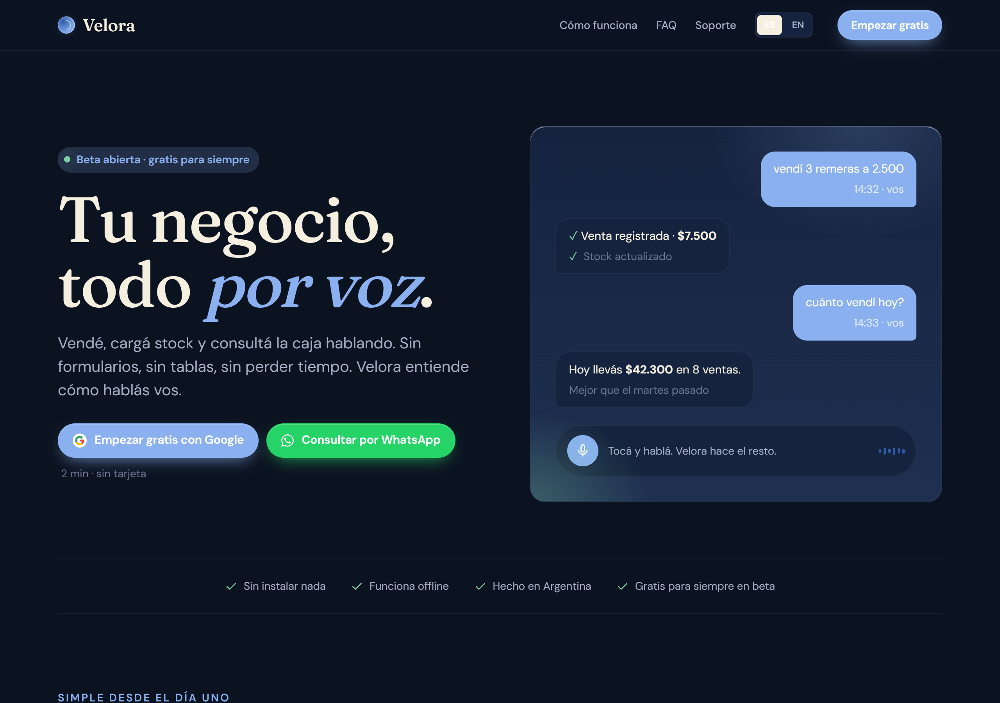
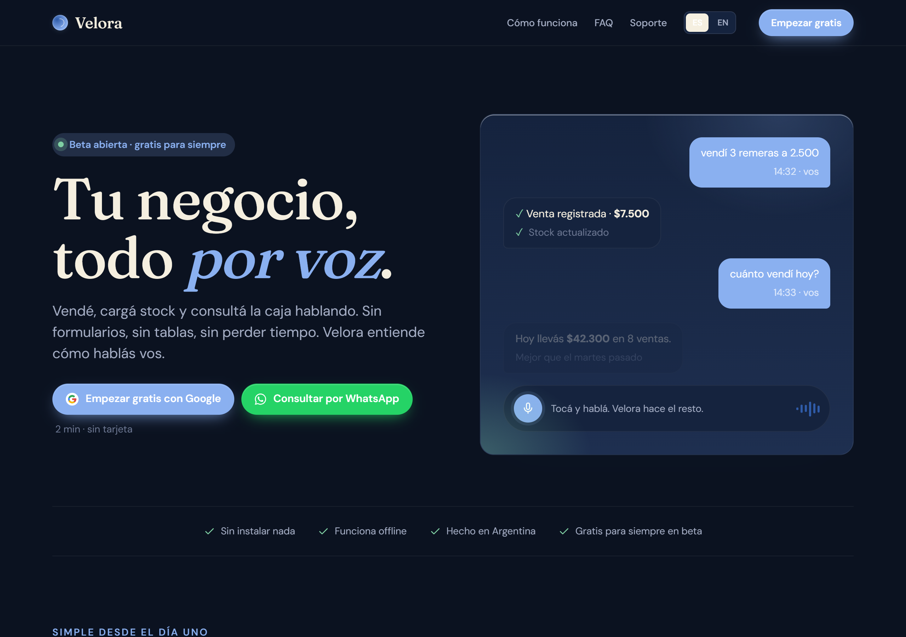
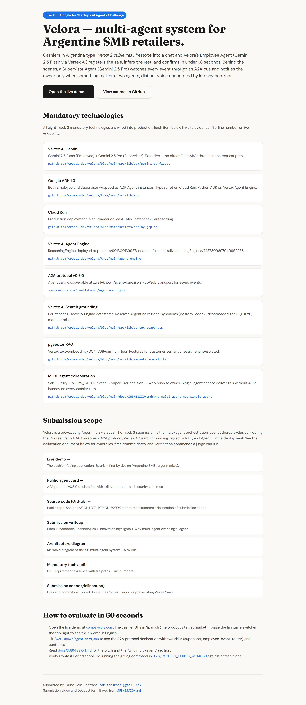

# Velora — A2A Interoperability Layer for Multi-Agent Enterprise Coordination (LATAM)

> **Google for Startups AI Agents Challenge — Track 3 submission.**
> A customer messages the business on WhatsApp. AI agents sell, charge, invoice and ship — zero humans in the loop. The owner directs everything from one chat.


| Track 3 entry points |  |
|----------------------|--|
| **Live demo (Spanish-first, EN toggle)** | https://somosvelora.com |
| **Judge tour (always English)** | https://somosvelora.com/track3 |
| **Public agent card (A2A v0.3.0)** | https://somosvelora.com/.well-known/agent-card.json |
| **Submission writeup** | [docs/SUBMISSION_DESCRIPTION.md](./docs/SUBMISSION_DESCRIPTION.md) |
| **Architecture diagram (Mermaid)** | [docs/ARCHITECTURE.md](./docs/ARCHITECTURE.md) |
| **Contest Period scope delineation** | [docs/CONTEST_PERIOD_WORK.md](./docs/CONTEST_PERIOD_WORK.md) |
| **Mandatory tech audit (per-requirement evidence)** | [docs/SUBMISSION_DESCRIPTION.md § Track 3 Mandate Compliance](./docs/SUBMISSION_DESCRIPTION.md#track-3-mandate-compliance) |



## What it is

Velora is a B2B AI-native operating system for Argentine SMBs and franchise networks. The owner types `vendí 2 cubiertas Firestone` into a chat — or a customer sends a WhatsApp message — and a multi-agent system fully orchestrated on Google Cloud registers the sale, charges the customer, emits the invoice, and dispatches the shipment in one continuous autonomous loop. A Supervisor agent (Gemini 2.5 Pro) orchestrates 8 A2A sub-agents and notifies the owner only when something matters.

| | |
|---|---|
|  |  |
| Spanish-first landing (`somosvelora.com`) for the Argentine target market | Always-English judge tour (`/track3`) explaining every mandatory tech with proof links |

## Why multi-agent over single-agent

A single Gemini call carrying all agent contexts runs 4-5s per turn — perceptible lag that stalls the customer interaction. The contract-based separation lets:

- **Customer Agent** (Gemini 2.5 Flash via Vertex AI) — sub-2s p99 on the customer-facing WhatsApp path. Sells, quotes shipping, collects payment, confirms asynchronously. The only latency the end customer feels.
- **Supervisor Agent** (Gemini 2.5 Pro via Vertex AI) — analytical "Operations Manager" voice on the owner-facing chat path. Orchestrates all 8 specialist sub-agents, validates business rules, decides notification severity (`now` / `daily` / `drop`). Routing all turns through Pro would 20× cost without 20× value.
- **Companion Agent** (shelved) (Gemini 2.5 Flash via Vertex AI) — internal module handling employee-facing operations (sales recording, stock queries, escalation to Supervisor). Architecture component; not the primary user story.

The Supervisor and its 8 sub-agents communicate over the **A2A protocol v0.3.0** with signed JSON-RPC 2.0 calls and Ed25519 agent identity. The Supervisor runs on **Cloud Run** as a TypeScript ADK wrapper (interactive path) AND on **Vertex AI Agent Engine** as a Python AdkApp (`projects/<project>/locations/us-central1/reasoningEngines/<id>`, live id at somosvelora.com/track3) — the Agent Engine path connects to Velora's live MCP server via `ADK MCPToolset + StreamableHTTPConnectionParams` (defined in `agent-engine/supervisor_agent.py`, `_build_mcp_toolset()`; `agent-engine/main.py` is the `AdkApp` entry point) and executes real commerce operations (catalog lookup, sale registration, payment links, invoices) through the same 51 production tools.

## Try it with Gemini CLI

The fastest way for a judge to run a live Velora tool call:

```bash
# Install Gemini CLI (requires Node 18+)
npm install -g @google/gemini-cli

# Clone this repo — .gemini/settings.json with demo key is included
git clone https://github.com/crossi-dev/velora-track3
cd velora-track3

# Start Gemini CLI — auto-loads MCP from settings.json
gemini

# Try these queries:
# > list the products in my catalog
# > register a sale of 2 "Mochila Urbana" at $15000 each
# > what's the current cash balance?
```

Alternatively, add the server without cloning:

```bash
gemini mcp add velora \
  --transport http \
  --url https://tools.somosvelora.com/api/mcp \
  --header "X-API-Key: <get from .gemini/settings.json>" \
  --header "X-Business-Id: cmpow3rq70009s601j07xgmf0"
```

The `.gemini/settings.json` file at the repo root contains the demo tenant HMAC key (scoped to a single demo business) and the live MCP endpoint. The key authenticates against `tools.somosvelora.com/api/mcp` (51 tools, 14 packs — source: `src/lib/mcp/server.ts`).

## Track 3 mandatory technologies

| # | Mandate | Implementation | Status |
|---|---------|----------------|--------|
| 1 | Vertex AI Gemini exclusive | Flash + Pro via `@google-cloud/vertexai`. No OpenAI/Anthropic in the request path. Velora's own inference is 100% Gemini; the MCP tool layer is engine-agnostic by design — external MCP clients (Claude Code, ChatGPT) can call Velora's tools, which never routes Velora's inference through those vendors. | LIVE |
| 2 | ADK orchestration | TypeScript ADK on Cloud Run (interactive) + Python ADK on Agent Engine (executes commerce via MCP) | LIVE |
| 3 | Cloud Run runtime | `southamerica-east1`, scale-to-zero by default; a min-instance can be warmed for the judging window via Cloud Run update (operational scripts live in the full development repo) | LIVE |
| 4 | Multi-agent design | Supervisor + 8 A2A sub-agents + Companion (shelved) + Customer Agent + Onboarding + velora_search_agent | LIVE |
| 5 | Vertex Agent Engine | Reasoning Engine deployed via Python ADK SDK — calls live MCP tools (verified: `query_catalog` returns real data) | Deployed · verified (routing flag-gated) |
| 6 | Grounding (Vertex AI Search) | Per-tenant Discovery Engine datastores — "bolso para la espalda" → Mochila; "para tomar mate" → Mate | LIVE |
| 7 | RAG (pgvector) | Vertex `text-embedding-004` (768-dim) on Supabase Postgres for customer semantic recall — strict per-tenant isolation | Flag-gated (`USE_EMBEDDINGS`) |
| 8 | B2B interoperability + MCP tool layer | Supervisor + 8 A2A sub-agents communicate over A2A v0.3.0 (Ed25519 signed JSON-RPC 2.0). The MCP server (51 tools, 14 packs) is the engine-agnostic tool layer — any MCP-compatible engine (TypeScript ADK, Python ADK on Agent Engine, or future engines) calls the same 51 tools via the same endpoint | LIVE |

## Architecture

```
┌─ Browser (Spanish-first) ─┐  ┌─ Owner mobile ─┐  ┌─ WhatsApp (Meta) ─┐
│  PWA · Next.js 16          │  │  Capacitor APK  │  │  Inbound B2C       │
└──────────┬─────────────────┘  └────────┬────────┘  └────────┬───────────┘
           │ HTTPS                        │ HTTPS              │ Cloud Tasks
┌──────────▼──────────────────────────────▼────────────────────▼───────────┐
│                     CLOUD RUN — southamerica-east1                       │
│                                                                          │
│  /api/business-assistant                                                 │
│    ├─ Supervisor Agent (Gemini 2.5 Pro · ADK TS)                        │
│    │    └─ 8 A2A FunctionTools → Payments · Fiscal · Logística          │
│    │                             Ventas · Caja · Inventario             │
│    │                             Communications · Customer Agent        │
│    ├─ Companion Agent (shelved · Gemini 2.5 Flash · employee POS)       │
│    ├─ Customer Agent (Gemini 2.5 Flash · WhatsApp B2C)                  │
│    └─ Onboarding Agent                                                  │
│                                                                          │
│  velora_search_agent ──► Vertex AI Search [LIVE]                        │
│  per-tenant Discovery Engine datastores                                  │
│  "bolso para la espalda" → Mochila ✓                                    │
└──────────────────────────────────────────────────────────────────────────┘
           │
    ┌──────┼──────────────────────────────┐
    ▼      ▼                              ▼
Supabase  Vertex AI Agent Engine     MCP Server
Postgres  Python ADK AdkApp          tools.somosvelora.com/api/mcp
primary   MCPToolset →               51 tools · 14 packs
          live MCP tools ──────────► engine-agnostic · HMAC auth
          (query_catalog ✓           [called by TS ADK + Python AE]
           register_sale ✓)
```

Mermaid version: [docs/ARCHITECTURE.md](./docs/ARCHITECTURE.md).

## Tech stack

| Layer | Technology |
|-------|-----------|
| **Intelligence** | **Gemini 2.5 Pro** (Supervisor, `us-south1`) + **Gemini 2.5 Flash** (Companion (shelved) / Customer Agent, `southamerica-east1`) via Vertex AI (`@google-cloud/vertexai`) |
| **Orchestration — primary** | **Google ADK** for TypeScript (`@google/adk`) on Cloud Run — interactive chat |
| **Orchestration — managed** | **Vertex AI Agent Engine** Python ADK (`google-adk`) — executes real commerce via MCP tools |
| **Tool layer** | MCP server (StreamableHTTP, 51 tools, 14 packs, HMAC auth) — engine-agnostic |
| **A2A** | `@a2a-js/sdk` v0.3.0 — JSON-RPC 2.0 over HTTPS, Ed25519 JWKS per-agent identity |
| **Multi-agent topology** | Supervisor + 8 A2A sub-agents + Companion (shelved) + Customer Agent + Onboarding + velora_search_agent |
| **Grounding** | Vertex AI Search Discovery Engine — per-tenant datastores (LIVE) |
| **RAG** | pgvector + Vertex `text-embedding-004` on Supabase Postgres (flag-gated) |
| **Agent runtime** | Cloud Run (`southamerica-east1`) + Vertex Agent Engine (`us-central1`) |
| **Frontend** | Next.js 16 (App Router), React 19, TypeScript strict |
| **Database** | Supabase Postgres (pgbouncer pooler) + pgvector + Prisma v6 |
| **Auth** | NextAuth v5 Google OAuth (owner) + custom HMAC PIN cookie (employee) |
| **Mobile** | Capacitor Android (native push, Google Sign-In, offline queue) |
| **WhatsApp** | Meta Cloud API (primary, inbound via Cloud Tasks) + Twilio (legacy fallback) |
| **Observability** | Cloud Logging (`cloudLog()`) + Cloud Monitoring |
| **Tests** | 278 unit test files (+ shared runner) + 119 vitest files + phase4 integration suites + e2e journeys (`node --test` + Playwright) |

## A2A protocol (Agent-to-Agent v0.3.0)

Velora implements A2A v0.3.0 across 12 agents (Supervisor + 8 specialist sub-agents + Companion (shelved) + Customer Agent + Onboarding). Any A2A-compatible client — Salesforce, SAP, AWS Bedrock AgentCore, Microsoft Agent Framework, Google's own ADK — can discover and call Velora's Supervisor without a custom integration. The 12 agents that expose `/.well-known/agent-card.json` and Ed25519 JWKS identity are: Supervisor, Companion (shelved), Payments, Fiscal, Logística, Ventas, Caja, Inventario, Communications, Customer, Onboarding, and Equipo (shelved; card present). `velora_search_agent` is an internal grounding sub-agent and does not expose its own agent card.

```bash
# Discovery (no auth)
curl https://somosvelora.com/.well-known/agent-card.json

# Send a message (X-API-Key required).
# The key is tenant-scoped, derived as HMAC-SHA256(A2A_SECRET, "v1:" + businessId)
# encoded base64url — see deriveA2AKey() in src/app/api/a2a/jsonrpc/_lib/handle-rpc.ts.
# A static/global key is rejected with 401.
curl -X POST https://somosvelora.com/api/a2a/jsonrpc \
  -H "Content-Type: application/json" \
  -H "X-API-Key: $A2A_API_KEY" \
  -d '{
    "jsonrpc": "2.0",
    "id": 1,
    "method": "message/send",
    "params": {
      "message": {
        "kind": "message",
        "messageId": "uuid",
        "role": "user",
        "parts": [{ "kind": "text", "text": "¿qué hacés?" }]
      }
    }
  }'
```

Full A2A loopback demo script lives in the full development repository (`scripts/a2a-demo.mjs`).

## Operational runbooks

11 incident playbooks in [docs/RUNBOOKS.md](./docs/RUNBOOKS.md): Cloud Run 5xx, p99 latency, Pub/Sub backlog, Vertex AI errors, Supabase Postgres pool exhaustion, DLQ messages, cron failures, Agent Engine query failures, ADK Supervisor failures, Tier-1 money-path alerts, /api/health uptime. Each: diagnose → mitigate → root cause → escalation.

Cloud Monitoring dashboard: 5 tiles (request count, latency p50/p95/p99, instance count, Pub/Sub backlog, Vertex predictions). Alert thresholds: 5xx >1%, p99 >5s, backlog >100. Email channel: `gestiones@somosvelora.com`.

## Deploy

Operational scripts for activating Track 3 flags, creating Cloud Scheduler jobs, deploying the Agent Engine, and setting up monitoring live in the full development repository. The public snapshot contains only the source code.

For the production deployment:

```bash
# Owner runs once — interactive auth
gcloud auth login
gcloud auth application-default login

# Production standard (Google Cloud 2026):
# 1. Connect GitHub repo to a Cloud Build trigger
# 2. Point the trigger at cloudbuild-dockerfile.yaml
# 3. Deploy from Git events so Cloud Build supplies COMMIT_SHA / SHORT_SHA
#
# Official docs:
# - Cloud Build triggers:
#   https://cloud.google.com/build/docs/triggers
# - Build from GitHub:
#   https://cloud.google.com/build/docs/automating-builds/github/build-repos-from-github
# - Deploy to Cloud Run with Cloud Build:
#   https://cloud.google.com/build/docs/deploying-builds/deploy-cloud-run
#
# Break-glass local run (non-canonical only if the trigger is unavailable):
gcloud builds submit --config cloudbuild-dockerfile.yaml \
  --substitutions=SHORT_SHA=$(git rev-parse --short HEAD),COMMIT_SHA=$(git rev-parse HEAD) \
  .
```

The Vertex AI Agent Engine is registered as a Reasoning Engine at `projects/<project>/locations/us-central1/reasoningEngines/<id>` (live id at somosvelora.com/track3). The Agent Engine connects to Velora's live MCP server via `ADK MCPToolset` in `agent-engine/supervisor_agent.py` (`_build_mcp_toolset()`); `agent-engine/main.py` is the `AdkApp` entry point that wraps it for the Reasoning Engine runtime.

## Testing

```bash
npm test              # unit + phase4 integration
npm run test:unit     # 278 unit test files (+ shared runner) (node --test runner)
npm run test:vitest   # 119 vitest files
npm run test:e2e      # e2e journeys (Playwright + contract tests against deployed URL)
npm run lint          # ESLint
npx tsc --noEmit      # TypeScript strict check
```

## Project origin & Contest Period scope

Velora is a pre-existing Argentine SMB SaaS owned by the entrant. The Track 3 submission is the **multi-agent orchestration layer** authored exclusively during the Contest Period (April 22 – June 5, 2026): ADK wrappers, A2A protocol, Vertex AI Search grounding, pgvector RAG, and Vertex Agent Engine deployment. Track 3's own description explicitly invites this pattern: *"Got an existing agent that is ready for prime time? This track is dedicated to taking your current, functional agents and refactoring their architecture to meet the requirements of the Google Cloud ecosystem."*

The exact file/commit delineation is in [docs/CONTEST_PERIOD_WORK.md](./docs/CONTEST_PERIOD_WORK.md). This public repository is a single-commit sanitized snapshot; the full contest-period history (3,180+ non-merge commits during the April 22 – June 5 contest period; repository history runs through the June 11 extended submission deadline) is delineated in docs/CONTEST_PERIOD_WORK.md and auditable on request.

## Environment variables

See `src/lib/env.ts` for the full list. Required for production:

- `DATABASE_URL` — Supabase Postgres
- `AUTH_SECRET` — NextAuth JWT signing key
- `GOOGLE_CLIENT_ID` / `GOOGLE_CLIENT_SECRET` — Google OAuth (owner)
- `GCP_PROJECT_ID` — your GCP project ID
- `VERTEX_LOCATION` — `us-central1`

Track 3 feature flags:

- `USE_ADK` — ADK orchestration (default `true`)
- `USE_VERTEX_SEARCH` — semantic product matching via Vertex AI Search Discovery Engine (LIVE in production)
- `USE_EMBEDDINGS` — pgvector customer recall (flag-gated; enable once embeddings table is populated)
- `USE_AGENT_ENGINE` — forward chat through Agent Engine (flag-gated; interactive traffic uses Cloud Run path)
- `AGENT_ENGINE_RESOURCE_NAME` — `projects/my-gcp-project/locations/us-central1/reasoningEngines/AGENT_ENGINE_ID`

Optional:

- `A2A_API_KEY` — A2A endpoint auth
- `TWILIO_*` / `WHATSAPP_*` — WhatsApp integrations
- `R2_*` — PDF storage
- `A2A_PUBLIC_BASE_URL` — agent card canonical URL override (default `https://somosvelora.com`)

Full template: [docs/ENV_CLOUDRUN_TEMPLATE.md](./docs/ENV_CLOUDRUN_TEMPLATE.md).

## License

Proprietary. All rights reserved.

---

*Submitted to the [Google for Startups AI Agents Challenge](https://cloud.google.com/blog/topics/startups/startups-are-building-the-agentic-future-with-google-cloud) — Track 3.*
