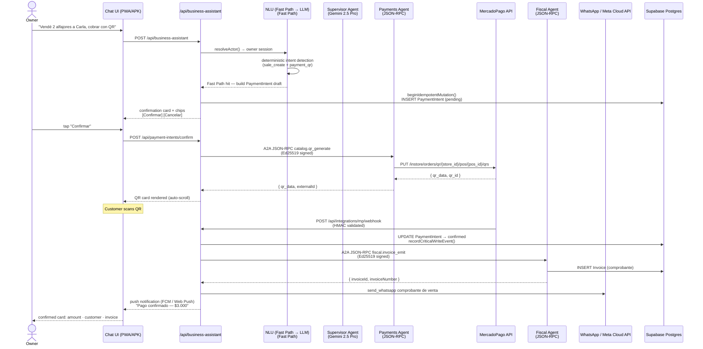
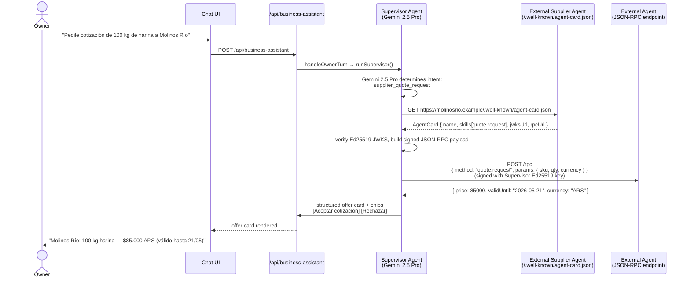

# Velora — Architecture Reference

**Track 3: Refactor for Google Cloud Marketplace & Gemini Enterprise**  
**Runtime region**: `southamerica-east1` (Cloud Run primary)

---

## Multi-Agent System Overview

```mermaid
graph TB
    subgraph Client["Client Layer"]
        PWA["PWA / Next.js 16<br/>(somosvelora.com)"]
        APK["Capacitor Android APK<br/>(native FCM + Google Auth)"]
        WPP_IN["WhatsApp Inbound<br/>(Meta Cloud API)"]
    end

    subgraph MCP["MCP Server — tools.somosvelora.com/api/mcp"]
        MCP_SRV["51 tools · 14 packs<br/>engine-agnostic · HMAC auth"]
        MCP_TOOLS["query_catalog · register_sale<br/>create_tracked_payment_link<br/>emit_invoice · quote_shipping<br/>+ 43 more"]
    end

    subgraph AgentEngine["Vertex AI Agent Engine — us-central1"]
        AE_PY["Python Supervisor<br/>ADK AdkApp (vertexai.agent_engines)<br/>agent-engine/main.py"]
        AE_MCP["ADK MCPToolset<br/>StreamableHTTPConnectionParams<br/>→ MCP Server (live tools)"]
        AE_GEM["Gemini 2.5 Pro<br/>Model Garden"]
    end

    subgraph CloudRun["Cloud Run — southamerica-east1"]
        direction TB
        BA["/api/business-assistant<br/>Chat pipeline hub"]
        WPP_WORKER["/api/internal/tasks/whatsapp-inbound<br/>Cloud Tasks OIDC worker"]

        subgraph Supervisor["Supervisor Agent (Owner) — ADK TS Runner"]
            SUP["Gemini 2.5 Pro<br/>orchestrator + policy enforcer"]
            SUP_CARD["/.well-known/agent-card.json<br/>A2A v0.3.0 discovery"]
            SUP_JWKS["/api/agents/supervisor/jwks<br/>Ed25519 public key"]
            subgraph RoleAgents["A2A Sub-Agent Tools (ADK FunctionTools)"]
                RA_PAYMENTS["call_payments_agent"]
                RA_FISCAL["call_fiscal_agent"]
                RA_LOGISTICA["call_logistica_agent"]
                RA_VENTAS["call_ventas_agent"]
                RA_CAJA["call_caja_agent"]
                RA_INVENTARIO["call_inventario_agent"]
                RA_COMMS["call_communications_agent"]
                RA_EQUIPO["call_equipo_agent"]
            end
        end

        subgraph Companion["Companion Agent (Employee — internal)"]
            COMP["Gemini 2.5 Flash<br/>POS assistant"]
            NLU["NLU: Deterministic Fast Path → Flash"]
        end

        subgraph CustomerAgent["Customer Agent (WhatsApp B2C)"]
            CA["Gemini 2.5 Flash<br/>B2C chat — runCustomerAgent()"]
            CA_CARD["/api/agents/customer/agent-card"]
        end

        subgraph Onboarding["Onboarding Agent"]
            OA["Gemini 2.5 Flash<br/>guided business setup"]
        end

        subgraph Payments["Payments Sub-Agent"]
            PAY_RPC["/api/agents/payments/jsonrpc"]
            PAY_CARD["/api/agents/payments/agent-card"]
            PAY_JWKS["/api/agents/payments/jwks"]
            PI["/api/payment-intents/ (create/confirm/refund)"]
        end

        subgraph Fiscal["Fiscal Sub-Agent"]
            FIS_RPC["/api/agents/fiscal/jsonrpc"]
            FIS_CARD["/api/agents/fiscal/agent-card"]
            FIS_JWKS["/api/agents/fiscal/jwks"]
        end

        subgraph LogisticaAgent["Logistica Sub-Agent"]
            LOG_RPC["/api/agents/logistica/jsonrpc"]
            LOG_CARD["/api/agents/logistica/agent-card"]
            LOG_JWKS["/api/agents/logistica/jwks"]
        end

        subgraph OtherAgents["Other Sub-Agents (Ventas · Caja · Inventario · Communications · Equipo)"]
            OA_RPC["JSON-RPC 2.0 handlers<br/>A2A v0.3.0 · Ed25519 identity"]
        end

        subgraph SearchAgent["velora_search_agent (Grounding)"]
            SA["Vertex AI Search<br/>per-tenant Discovery Engine datastore<br/>velora-products-{tenant-id}"]
        end

        A2ABUS["/api/a2a/<br/>A2A event bus · dead-letter · jsonrpc"]
        SCHED["/api/scheduled/<br/>rule-alerts · audit-cleanup<br/>16 Cloud Scheduler jobs"]
    end

    subgraph VertexAI["Vertex AI — multi-region"]
        GEM_PRO["Gemini 2.5 Pro<br/>us-south1 (Supervisor)"]
        GEM_FLASH["Gemini 2.5 Flash<br/>southamerica-east1 (Companion · Customer)"]
        VSEARCH_DS["Vertex AI Search<br/>Discovery Engine<br/>per-tenant datastores (enable: USE_VERTEX_SEARCH=true)"]
    end

    subgraph Storage["Storage & Secrets"]
        SUPADB["Supabase Postgres<br/>primary · RateLimitBucket · CronCheckpoint"]
        SM["Secret Manager<br/>MP tokens · VAPID · A2A_SECRET · ARCA certs"]
        CS["Cloud Storage<br/>Agent Engine staging"]
        LOGS["Cloud Logging · cloudLog()"]
    end

    subgraph External["External Integrations"]
        MP_EXT["MercadoPago API<br/>QR payments + OAuth + Webhooks"]
        WA_EXT["WhatsApp — Meta Cloud API<br/>inbound B2C · outbound receipts"]
        AFIP["AFIP ARCA — WSAA + WSFE SOAP<br/>(sandbox; real endpoint flag-gated)"]
        AND_EXT["Andreani API<br/>shipment quote · create · track"]
        FCM["Firebase Cloud Messaging<br/>native push — Android APK"]
        CT["Cloud Tasks<br/>velora-whatsapp-inbound queue"]
    end

    PWA -->|HTTPS| BA
    APK -->|HTTPS + native headers| BA
    WPP_IN -->|Meta webhook| WPP_WORKER
    WPP_IN -->|enqueue <1s| CT
    CT -->|OIDC| WPP_WORKER
    WPP_WORKER --> CustomerAgent

    BA --> Supervisor
    BA --> Companion
    BA --> Onboarding

    RA_PAYMENTS -->|A2A JSON-RPC · Ed25519 signed| Payments
    RA_FISCAL -->|A2A JSON-RPC · Ed25519 signed| Fiscal
    RA_LOGISTICA -->|A2A JSON-RPC · Ed25519 signed| LogisticaAgent
    RA_VENTAS -->|A2A JSON-RPC| OtherAgents
    RA_CAJA -->|A2A JSON-RPC| OtherAgents
    RA_INVENTARIO -->|A2A JSON-RPC| OtherAgents
    RA_COMMS -->|A2A JSON-RPC| OtherAgents
    RA_EQUIPO -->|A2A JSON-RPC| OtherAgents

    Supervisor -->|Gemini 2.5 Pro| GEM_PRO
    Companion -->|Gemini 2.5 Flash| GEM_FLASH
    CustomerAgent -->|Gemini 2.5 Flash| GEM_FLASH

    SearchAgent -->|semantic catalog lookup — USE_VERTEX_SEARCH=true| VSEARCH_DS
    NLU -->|grounding| SearchAgent

    AE_PY -->|ADK MCPToolset| AE_MCP
    AE_MCP -->|StreamableHTTP → live tools| MCP_SRV
    AE_PY --> AE_GEM
    MCP_SRV --> MCP_TOOLS

    Payments --> MP_EXT
    Fiscal --> AFIP
    LogisticaAgent --> AND_EXT
    CustomerAgent --> WA_EXT
    BA --> WA_EXT

    BA --> SUPADB
    Payments --> SUPADB
    Fiscal --> SUPADB
    SCHED -->|CRON_SECRET bearer| CloudRun
    CloudRun --> SM
    CloudRun --> LOGS
    AE_PY --> CS
    BA -->|FCM / Web Push fan-out| FCM
```



---

## Agent Topology (2026-06-09)

Velora runs a three-runtime multi-agent system on Google Cloud.

### Runtime 1 — Cloud Run TypeScript ADK (interactive, primary)

The Supervisor is an ADK `Agent` running in a TypeScript `InMemoryRunner`. It holds eight active **A2A sub-agent FunctionTools** that issue real A2A HTTP JSON-RPC calls to specialist agents:

| A2A Tool | Sub-Agent Endpoint | Responsibility |
|---|---|---|
| `call_payments_agent` | `/api/agents/payments/jsonrpc` | MercadoPago QR + OAuth + payment lifecycle |
| `call_fiscal_agent` | `/api/agents/fiscal/jsonrpc` | ARCA WSAA + WSFE SOAP — electronic invoicing |
| `call_logistica_agent` | `/api/agents/logistica/jsonrpc` | Andreani shipment quote / create / track |
| `call_ventas_agent` | `/api/agents/ventas/jsonrpc` | Catalog queries, cross-sell |
| `call_caja_agent` | `/api/agents/caja/jsonrpc` | Cash register open/close/movements |
| `call_inventario_agent` | `/api/agents/inventario/jsonrpc` | Stock load, adjustments, movements |
| `call_communications_agent` | `/api/agents/communications/jsonrpc` | WhatsApp send, template dispatch |
| `call_equipo_agent` (shelved) | `/api/agents/equipo/jsonrpc` | Employee management, permissions — shelved; card present, tool inactive |

Plus three additional agents not in the Supervisor's tool belt but running on Cloud Run:
- **Companion Agent** — Employee POS assistant (Gemini 2.5 Flash, internal module, no A2A hop)
- **Customer Agent** — WhatsApp B2C chat; async via Cloud Tasks + OIDC worker
- **Onboarding Agent** — Guided first-time business setup

### Runtime 2 — Vertex AI Agent Engine Python ADK (real commerce execution)

The Python Supervisor (`agent-engine/main.py`) is deployed as a `vertexai.agent_engines` Reasoning Engine. It connects to Velora's live MCP server via `ADK MCPToolset + StreamableHTTPConnectionParams`, reusing the same 48 production tools instead of reimplementing them:

- `query_catalog` → real catalog lookup (verified: returns live data)
- `register_sale` → records a sale
- `create_tracked_payment_link` → MercadoPago payment link
- `emit_invoice` → ARCA electronic invoice
- + 47 more tools from the MCP server

The Agent Engine Python path uses Gemini 2.5 Pro and is the managed-runtime mandate satisfier for Track 3.

### Runtime 3 — MCP Server (engine-agnostic tool layer)

The MCP server (`tools.somosvelora.com/api/mcp`) exposes 51 tools across 14 packs over StreamableHTTP. Any MCP-compatible engine (Claude Code, Gemini, OpenAI, or any future engine) can call Velora's tools using the same HMAC auth — no per-engine rework. The Agent Engine Python runtime is the first non-TypeScript consumer.

### Grounding — velora_search_agent

Vertex AI Search Discovery Engine datastores are provisioned per tenant (`velora-products-{tenant-id}`). The code is deployed and wired; enable with `USE_VERTEX_SEARCH=true`. When enabled, semantic catalog search resolves queries like "bolso para la espalda" → "Mochila"; "para tomar mate" → "Mate". The `velora_search_agent` wraps this grounding layer and is called by the NLU pipeline on catalog intents.

The `usedAdkDelegation` flag in the Supervisor runner result is set to `true` whenever any delegation tool fires. The orchestrator timeout is controlled by `SUPERVISOR_ADK_TIMEOUT_MS` (Cloud Run override). It falls back to the direct-Gemini path on `TimeoutError`.

## Agent Identity Model

Each of the 12 agent-card endpoints (Supervisor, Companion*, Customer, Payments, Fiscal, Logística, Ventas, Caja, Inventario, Communications, Onboarding, Equipo†) exposes three endpoints:

> *Companion primarily runs as an internal module; its card enables federation.  
> †Equipo is shelved; the agent card is present but the tool is inactive.

| Endpoint | Purpose |
|----------|---------|
| `/.well-known/agent-card.json` or `/agent-card` | A2A v0.3.0 discovery — capabilities, skills, authentication |
| `/jwks` | Ed25519 public key for verifying agent signatures |
| `/jsonrpc` | JSON-RPC 2.0 handler — authenticated, HMAC-bound per-tenant |

All outbound A2A messages are signed with the agent's Ed25519 private key. Inbound messages are verified against the sender's JWKS. HMAC-bound per-tenant keys (derived from `A2A_SECRET`) prevent cross-tenant message leakage.

---

## Sequence: Owner Records a QR Payment Sale



---

## Sequence: A2A External Agent Discovery



---

## ASCII Fallback — High-Level Architecture

```
┌──────────────────────────────────────────────────────────────────────┐
│                        CLIENT LAYER                                  │
│  PWA (somosvelora.com)      Capacitor Android APK    WhatsApp (Meta) │
│  Next.js 16 · React 19      FCM push · Google Auth   inbound B2C    │
└──────────────────────────┬──────────────────────────────┬────────────┘
                           │ HTTPS                        │ Cloud Tasks
┌──────────────────────────▼──────────────────────────────▼────────────┐
│                CLOUD RUN — southamerica-east1                        │
│                                                                      │
│  /api/business-assistant                                             │
│    ├─ resolveActor (Owner OAuth / Employee PIN)                      │
│    ├─ NLU (Deterministic Fast Path → LLM Slow Path)                  │
│    │    └─ velora_search_agent ──► Vertex AI Search (USE_VERTEX_SEARCH=true) │
│    ├─ Supervisor Agent (ADK TS InMemoryRunner) ── Gemini 2.5 Pro     │
│    │    └─ 8 A2A Sub-Agent FunctionTools                             │
│    │         ├─ call_payments_agent   ──► Payments Agent             │
│    │         ├─ call_fiscal_agent     ──► Fiscal Agent               │
│    │         ├─ call_logistica_agent  ──► Logística Agent            │
│    │         ├─ call_ventas_agent     ──► Ventas Agent               │
│    │         ├─ call_caja_agent       ──► Caja Agent                 │
│    │         ├─ call_inventario_agent ──► Inventario Agent           │
│    │         ├─ call_communications_agent ─► Communications Agent    │
│    │         └─ call_equipo_agent     ──► Equipo Agent               │
│    ├─ Companion Agent ────────────────────── Gemini 2.5 Flash        │
│    ├─ Customer Agent (WhatsApp B2C) ───────── Gemini 2.5 Flash       │
│    └─ Onboarding Agent ────────────────────── Gemini 2.5 Flash       │
│                                                                      │
│  A2A Sub-Agents (v0.3.0 — JSON-RPC 2.0, Ed25519 signed, 8 agents)   │
│    ├─ Payments    ──► MercadoPago QR + OAuth + Webhooks              │
│    ├─ Fiscal      ──► ARCA WSAA + WSFE SOAP (sandbox)               │
│    ├─ Logística   ──► Andreani API                                   │
│    └─ Ventas · Caja · Inventario · Communications · Equipo           │
│                                                                      │
│  /api/scheduled/ (16 Cloud Scheduler jobs, CRON_SECRET bearer)       │
│    ├─ rule-alerts (*/5 min)    ─ business rule triggers              │
│    └─ audit-cleanup (daily)    ─ TTL on CriticalWriteEvent           │
└──────────────────────────────────────────────────────────────────────┘
                           │
        ┌──────────────────┼──────────────────────┐
        ▼                  ▼                      ▼
┌───────────────┐  ┌────────────────────┐  ┌──────────────────────────┐
│ Supabase      │  │ Vertex AI          │  │ MCP Server                    │
│ Postgres      │  │ Gemini 2.5 Pro     │  │ tools.somosvelora.com/api/mcp │
│ primary DB    │  │ Gemini 2.5 Flash   │  │ 51 tools · 14 packs           │
│ RateLimitBkt  │  │ Agent Engine       │  │ engine-agnostic HMAC     │
│ CronCheckpt   │  │  Python ADK        │  │   ▲                      │
└───────────────┘  │  MCPToolset        │──┘   │ StreamableHTTP       │
                   │  → live tools [✓]  │      │                      │
                   │ Vertex AI Search   │  ┌───┴──────────────────────┤
                   │  per-tenant [LIVE] │  │ External Services        │
                   └────────────────────┘  │ MercadoPago · ARCA SOAP  │
                                           │ Andreani · Meta WhatsApp │
                                           │ Firebase FCM             │
                                           └──────────────────────────┘
```

---

## Technology Stack

| Layer | Technology |
|-------|-----------|
| **Frontend** | Next.js 16 App Router, React 19, TypeScript strict, Tailwind v4 |
| **Mobile** | Capacitor Android (FCM push, Google Sign-In native, offline queue) |
| **Backend** | Next.js route handlers on Cloud Run (`southamerica-east1`) |
| **AI — Owner / Supervisor** | Gemini 2.5 Pro via `@google-cloud/vertexai` (Model Garden, `us-south1`) |
| **AI — Employee / Customer** | Gemini 2.5 Flash via `@google-cloud/vertexai` (`southamerica-east1`) |
| **Agent Runtime — primary** | Cloud Run TypeScript ADK (`@google/adk`) — interactive chat |
| **Agent Runtime — managed** | Vertex AI Agent Engine Python ADK (`vertexai.agent_engines`) — real commerce via MCP |
| **Tool layer** | MCP server (StreamableHTTP, 51 tools, 14 packs, HMAC auth) — engine-agnostic |
| **Semantic Search / Grounding** | Vertex AI Search Discovery Engine — per-tenant datastores (deployed; enable with `USE_VERTEX_SEARCH=true`) |
| **Agent Protocol** | A2A v0.3.0 — JSON-RPC 2.0 over HTTPS, Ed25519 JWKS identity |
| **Multi-agent topology** | Supervisor + 8 A2A sub-agents + Companion + Customer Agent + Onboarding + velora_search_agent |
| **Database** | Supabase Postgres + Prisma v6 |
| **Auth** | NextAuth v5 (Google OAuth owner) + PIN+cookie (employee) |
| **Payments** | MercadoPago QR + OAuth + Webhooks (`mp-token-cipher` AES-256) |
| **Push** | Web Push (VAPID) + Firebase Cloud Messaging (dual-channel fan-out) |
| **Fiscal** | ARCA WSAA + WSFE SOAP (Argentina electronic invoicing — sandbox path; real path flag-gated) |
| **WhatsApp** | Meta Cloud API (primary) + Cloud Tasks async worker (OIDC) |
| **Secrets** | Secret Manager (all credentials — never in env files) |
| **Observability** | Cloud Logging (`cloudLog()`) |
| **Scheduling** | Cloud Scheduler (16 jobs, `CRON_SECRET` bearer auth) |
