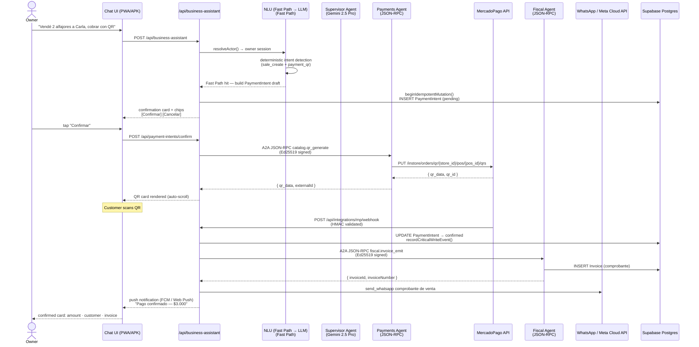
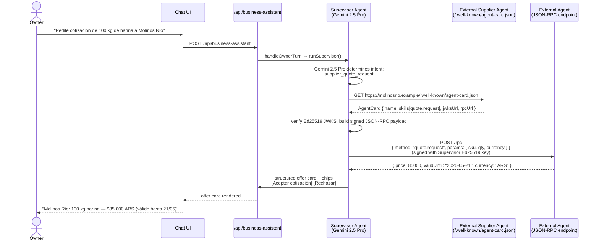

# Velora — Architecture Reference

**Track 3: Refactor for Google Cloud Marketplace & Gemini Enterprise**  
**Runtime region**: `southamerica-east1` (Cloud Run primary)

---

## Multi-Agent System Overview

```mermaid
graph TB
    subgraph Client["Client Layer"]
        PWA["PWA / Next.js 16<br/>(somosvelora.com)"]
        APK["Capacitor Android APK<br/>(native FCM + Google Auth)"]
    end

    subgraph CloudRun["Cloud Run — southamerica-east1"]
        direction TB
        BA["/api/business-assistant<br/>Chat pipeline hub"]

        subgraph Supervisor["Supervisor Agent (Owner) — ADK InMemoryRunner"]
            SUP["Gemini 2.5 Pro<br/>orchestrator + policy enforcer"]
            SUP_CARD["/.well-known/agent-card.json<br/>A2A v0.3.0 discovery"]
            SUP_JWKS["/api/agents/supervisor/jwks<br/>Ed25519 public key"]
            subgraph RoleAgents["Role-Agent Layer (ADK FunctionTools)"]
                RA_CONTADOR["call_contador_agent<br/>(fiscal / ARCA)"]
                RA_VENTAS["call_ventas_agent<br/>(payments / MercadoPago)"]
                RA_LOGISTICA["call_logistica_agent<br/>(logistics / Andreani)"]
                RA_MARKETPLACE["call_marketplace_agent<br/>(MercadoLibre — encajonado)"]
            end
        end

        subgraph Companion["Companion Agent (Employee)"]
            COMP["Gemini 2.5 Flash<br/>POS assistant (internal module)"]
            NLU["NLU (Fast Path → LLM)<br/>Deterministic Fast Path → LLM fallback"]
        end

        subgraph Payments["Payments Translator Agent"]
            PAY_RPC["/api/agents/payments/jsonrpc<br/>JSON-RPC 2.0 handler"]
            PAY_CARD["/api/agents/payments/agent-card<br/>A2A discovery"]
            PAY_JWKS["/api/agents/payments/jwks"]
            MP["/api/integrations/mp/<br/>MercadoPago OAuth + QR + Webhook"]
            PI["/api/payment-intents/<br/>create / confirm / refund / status"]
        end

        subgraph Fiscal["Fiscal Translator Agent"]
            FIS_RPC["/api/agents/fiscal/jsonrpc<br/>JSON-RPC 2.0 handler"]
            FIS_CARD["/api/agents/fiscal/agent-card<br/>A2A discovery"]
            FIS_JWKS["/api/agents/fiscal/jwks"]
            ARCA["ARCA / WSAA + WSFE<br/>SOAP bridge (sandbox mode pending credentials)"]
        end

        subgraph MlAgent["MercadoLibre Translator Agent (encajonado — code present, not deployed)"]
            ML_RPC["/api/agents/mercadolibre/jsonrpc<br/>JSON-RPC 2.0 handler"]
            ML_CARD["/api/agents/mercadolibre/agent-card<br/>A2A discovery"]
            ML_JWKS["/api/agents/mercadolibre/jwks"]
            ML_WH["/api/agents/mercadolibre/webhook<br/>HMAC-validated order push"]
        end

        subgraph AndreaniAgent["Andreani Translator Agent"]
            AND_RPC["/api/agents/andreani/jsonrpc<br/>JSON-RPC 2.0 handler"]
            AND_CARD["/api/agents/andreani/agent-card<br/>A2A discovery"]
            AND_JWKS["/api/agents/andreani/jwks"]
            AND_WH["/api/agents/andreani/webhook<br/>delivery status push"]
        end

        A2ABUS["/api/a2a/<br/>A2A event bus<br/>pubsub-handler / dead-letter / jsonrpc"]
        SCHED["/api/scheduled/<br/>rule-alerts · audit-cleanup<br/>10 Cloud Scheduler jobs"]
    end

    subgraph VertexAI["Vertex AI — multi-region (us-south1: Supervisor/Pro · southamerica-east1: Companion/Flash · us-central1: classifier)"]
        GEM_PRO["Gemini 2.5 Pro<br/>Model Garden"]
        GEM_FLASH["Gemini 2.5 Flash<br/>Model Garden"]
        AGENT_ENGINE["Vertex AI Agent Engine<br/>Python ADK — AdkApp<br/>agent-engine/main.py"]
        VSEARCH["Vertex AI Search<br/>per-tenant product datastore<br/>velora-products-{businessId}"]
    end

    subgraph Storage["Storage & Secrets"]
        SUPADB["Supabase Postgres<br/>primary datastore + RateLimitBucket + CronCheckpoint"]
        SM["Secret Manager<br/>MP tokens · VAPID · CRON_SECRET · A2A_SECRET"]
        CS["Cloud Storage<br/>agent-engine staging bucket"]
        LOGS["Cloud Logging<br/>cloudLog() — replaces console.warn"]
    end

    subgraph External["External Integrations"]
        MP_EXT["MercadoPago API<br/>QR payments + OAuth + Webhooks"]
        ML_EXT["MercadoLibre API<br/>catalog · orders · stock · pricing"]
        WA["WhatsApp (Meta Cloud API primary, Twilio fallback)<br/>comprobantes · escalation push"]
        AFIP["AFIP ARCA<br/>WSAA + WSFE SOAP (sandbox)"]
        AND_EXT["Andreani API<br/>shipment quote · create · track (mock mode pending credentials)"]
        FCM["Firebase Cloud Messaging<br/>native push — Android APK"]
    end

    PWA -->|HTTPS| BA
    APK -->|HTTPS + native headers| BA
    BA --> Supervisor
    BA --> Companion
    RA_CONTADOR -->|A2A HTTP JSON-RPC| Fiscal
    RA_VENTAS -->|A2A HTTP JSON-RPC| Payments
    RA_LOGISTICA -->|A2A HTTP JSON-RPC| AndreaniAgent
    RA_MARKETPLACE -->|A2A HTTP JSON-RPC| MlAgent
    Supervisor -->|Gemini 2.5 Pro| GEM_PRO
    Companion -->|Gemini 2.5 Flash| GEM_FLASH
    NLU -->|"catalog grounding (flag-gated: USE_VERTEX_SEARCH)"| VSEARCH
    A2ABUS -->|"Pub/Sub async events (flag-gated: USE_AGENT_ENGINE)"| AGENT_ENGINE
    AGENT_ENGINE --> GEM_PRO
    AGENT_ENGINE --> GEM_FLASH
    Payments --> MP_EXT
    Fiscal --> AFIP
    MlAgent --> ML_EXT
    MlAgent --> ML_WH
    AndreaniAgent --> AND_EXT
    BA --> SUPADB
    Payments --> SUPADB
    Fiscal --> SUPADB
    MlAgent --> SUPADB
    SCHED -->|CRON_SECRET bearer| CloudRun
    CloudRun --> SM
    CloudRun --> LOGS
    AGENT_ENGINE --> CS
    BA -->|FCM / Web Push fan-out| FCM
    BA --> WA
```



---

## Two-Layer Agent Topology

The Supervisor is an ADK `Agent` running in an `InMemoryRunner`. It holds three active **role-agent FunctionTools** (call_marketplace_agent encajonado) that sit between the orchestrator and the external translator agents. When Gemini 2.5 Pro decides to delegate, it invokes one of these tools in-band, which issues a real A2A HTTP JSON-RPC call to the matching translator agent:

| Role-Agent Tool | Routes to Translator Agent | External System |
|---|---|---|
| `call_contador_agent` | Fiscal Agent (`/api/agents/fiscal/jsonrpc`) | ARCA WSAA + WSFE SOAP |
| `call_ventas_agent` | Payments Agent (`/api/agents/payments/jsonrpc`) | MercadoPago QR + OAuth |
| `call_logistica_agent` | Andreani Agent (`/api/agents/andreani/jsonrpc`) | Andreani REST API |
| `call_marketplace_agent` | MercadoLibre Agent (`/api/agents/mercadolibre/jsonrpc`) | MercadoLibre API — encajonado, not active |

The `usedAdkDelegation` flag in the Supervisor runner result is set to `true` whenever any delegation tool fires. The orchestrator timeout is controlled by `SUPERVISOR_ADK_TIMEOUT_MS` (25s code default / 65s Cloud Run override per `agent-timeouts.ts`). It falls back to the direct-Gemini path on `TimeoutError`.

Translator agents run in mock/sandbox mode pending per-client credentials (Andreani: `ANDREANI_MOCK_MODE`; ARCA: WSAA sandbox; MercadoLibre: OAuth sandbox). The A2A wrapper pattern — agent-card discovery + Ed25519 identity + JSON-RPC transport — is the deliverable; live credentials are a per-tenant configuration step.

## Agent Identity Model

Each of the 3 active translator agents exposes three endpoints:

| Endpoint | Purpose |
|----------|---------|
| `/.well-known/agent-card.json` or `/agent-card` | A2A v0.3.0 discovery — capabilities, skills, authentication |
| `/jwks` | Ed25519 public key for verifying agent signatures |
| `/jsonrpc` | JSON-RPC 2.0 handler — authenticated, HMAC-bound per-tenant |

All outbound A2A messages are signed with the agent's Ed25519 private key. Inbound messages are verified against the sender's JWKS. HMAC-bound per-tenant keys (derived from `A2A_SECRET`) prevent cross-tenant message leakage.

---

## Sequence: Owner Records a QR Payment Sale



---

## Sequence: A2A External Agent Discovery



---

## ASCII Fallback — High-Level Architecture

```
┌─────────────────────────────────────────────────────────────────────┐
│                    CLIENT LAYER                                     │
│   PWA (somosvelora.com)          Capacitor Android APK              │
│   Next.js 16 · React 19          FCM native push · Google Auth      │
└───────────────────────────┬─────────────────────────────────────────┘
                            │ HTTPS
┌───────────────────────────▼─────────────────────────────────────────┐
│              CLOUD RUN — southamerica-east1                         │
│                                                                     │
│  /api/business-assistant                                            │
│    ├─ resolveActor (Owner OAuth / Employee PIN)                     │
│    ├─ NLU (Fast Path → LLM) (Deterministic Fast Path → LLM Slow Path)│
│    ├─ Supervisor Agent (ADK InMemoryRunner) ── Gemini 2.5 Pro       │
│    │    └─ Role-Agent Layer (ADK FunctionTools)                     │
│    │         ├─ call_contador_agent   ──► Fiscal Translator         │
│    │         ├─ call_ventas_agent     ──► Payments Translator       │
│    │         ├─ call_logistica_agent  ──► Andreani Translator       │
│    │         └─ call_marketplace_agent──► MercadoLibre Translator   │
│    └─ Companion Agent ─────────────────── Gemini 2.5 Flash          │
│                                                                     │
│  Translator Agents (A2A v0.3.0 — JSON-RPC 2.0, Ed25519 signed)     │
│    ├─ Payments Agent    ──► MercadoPago API                         │
│    ├─ Fiscal Agent      ──► ARCA (WSAA + WSFE SOAP, sandbox)        │
│    ├─ MercadoLibre Agent──► MercadoLibre API                        │
│    └─ Andreani Agent    ──► Andreani API (mock mode)                │
│                                                                     │
│  /api/scheduled/ (10 Cloud Scheduler jobs, CRON_SECRET bearer)      │
│    ├─ rule-alerts (*/5 min)   ─ business rule triggers              │
│    └─ audit-cleanup (daily)   ─ TTL on CriticalWriteEvent           │
└───────────────────────────┬─────────────────────────────────────────┘
                            │
          ┌─────────────────┼──────────────────────┐
          ▼                 ▼                      ▼
┌─────────────────┐ ┌─────────────────┐ ┌──────────────────────┐
│  Supabase Postgres  │ │  Vertex AI       │ │  External Services   │
│  primary DB     │ │  Gemini 2.5 Pro  │ │  MercadoPago API     │
│  RateLimitBucket│ │  Gemini 2.5 Flash│ │  MercadoLibre API    │
│  CronCheckpoint │ │  Agent Engine    │ │  ARCA SOAP (AFIP)    │
│  PaymentIntent  │ │  (Python ADK)    │ │  Andreani API        │
│  MpConnection   │ │  Vertex AI Search│ │  WhatsApp / Meta     │
└─────────────────┘ │  [flag-gated]    │ │  (Twilio fallback)   │
                    └─────────────────┘ │  Firebase (FCM)      │
                                         └──────────────────────┘
```

---

## Technology Stack

| Layer | Technology |
|-------|-----------|
| **Frontend** | Next.js 16 App Router, React 19, TypeScript strict, Tailwind v4 |
| **Mobile** | Capacitor Android (FCM push, Google Sign-In native, offline queue) |
| **Backend** | Next.js route handlers on Cloud Run (`southamerica-east1`) |
| **AI — Owner** | Gemini 2.5 Pro via `@google-cloud/vertexai` (Model Garden) |
| **AI — Employee** | Gemini 2.5 Flash via `@google-cloud/vertexai` |
| **Agent Runtime** | Vertex AI Agent Engine (Python ADK — `agent-engine/main.py`) |
| **Semantic Search** | Vertex AI Search — per-tenant product datastore |
| **Agent Protocol** | A2A v0.3.0 — JSON-RPC 2.0 over HTTPS, Ed25519 JWKS identity |
| **Database** | Supabase Postgres + Prisma v6 |
| **Auth** | NextAuth v5 (Google OAuth owner) + PIN+cookie (employee) |
| **Payments** | MercadoPago QR + OAuth + Webhooks (`mp-token-cipher` AES-256) |
| **Marketplace** | MercadoLibre API (catalog, orders, stock, pricing sync) |
| **Push** | Web Push (VAPID) + Firebase Cloud Messaging (dual-channel fan-out) |
| **Fiscal** | ARCA WSAA + WSFE SOAP (Argentina electronic invoicing — sandbox) |
| **WhatsApp** | Meta Cloud API (primary) + Twilio sandbox (fallback) — selected via `WHATSAPP_PROVIDER` env var (default `meta`) |
| **Secrets** | Secret Manager (all credentials — never in env files) |
| **Observability** | Cloud Logging (`cloudLog()`) |
| **Scheduling** | Cloud Scheduler (10 jobs, `CRON_SECRET` bearer auth) |
